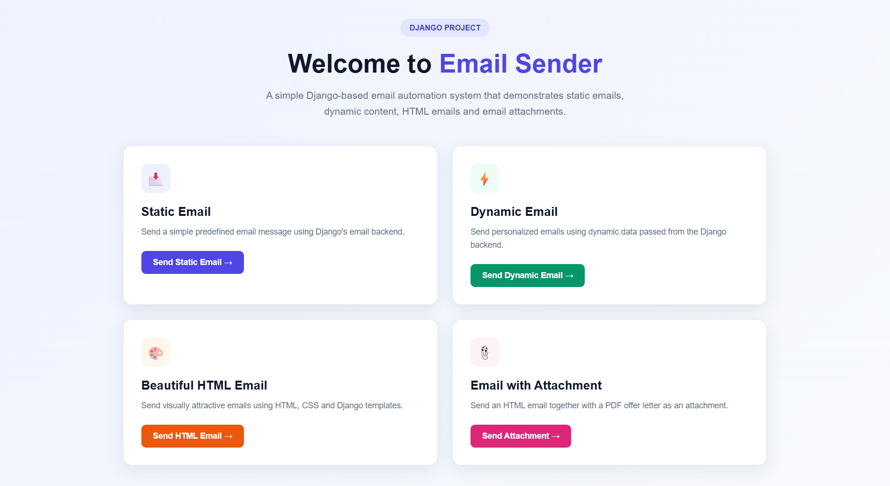
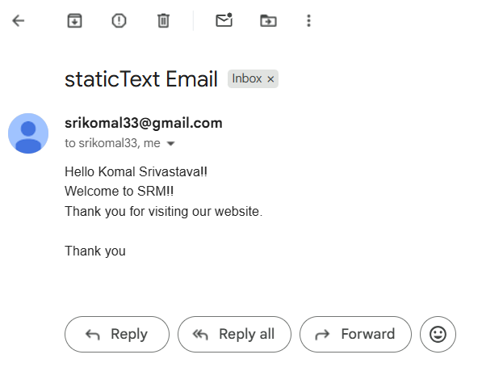
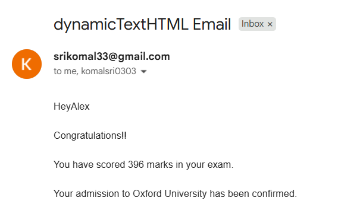
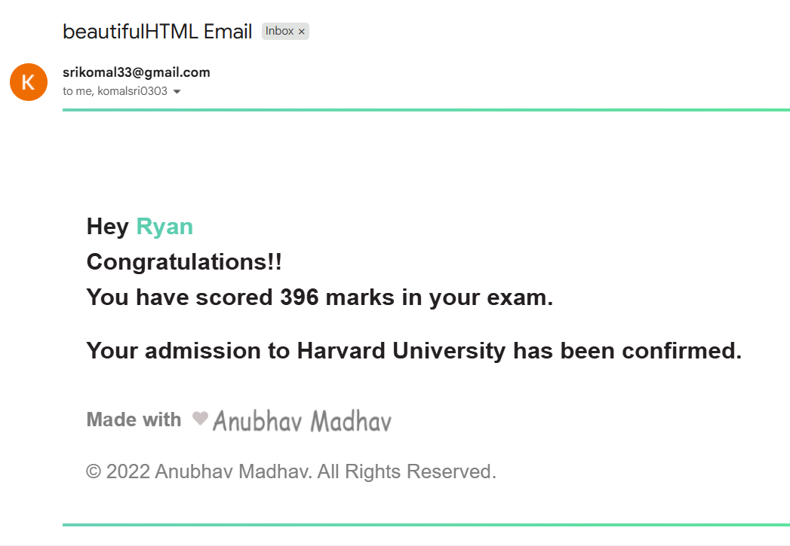
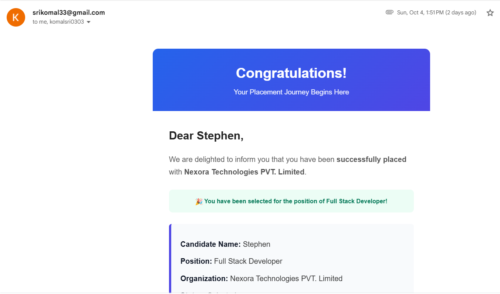
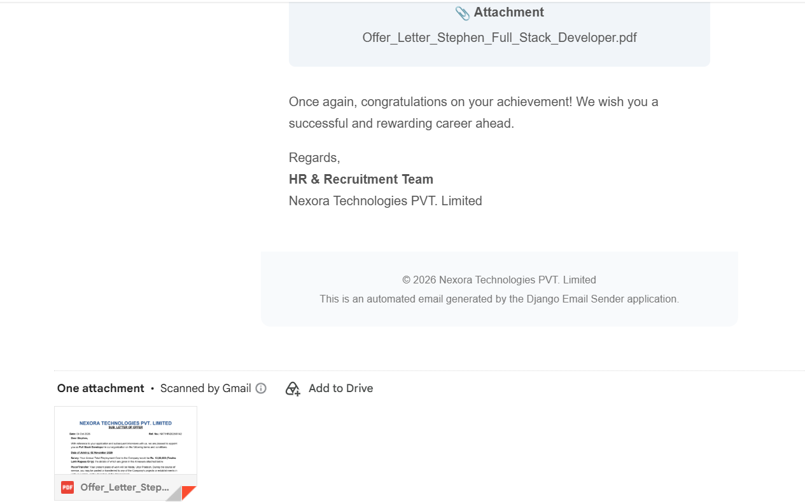
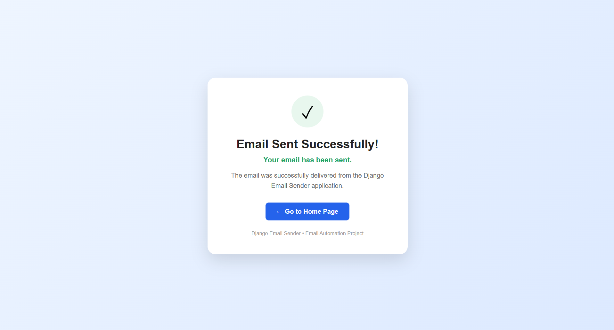

# 📧 Django Email Automation System

A Django-based email automation system that demonstrates how to send different types of emails using Django's email framework and Gmail SMTP.

## 🚀 Features

- ✉️ Send Static Text Emails
- 📝 Send Dynamic Emails using Django Templates
- 🎨 Send Beautiful HTML Emails
- 📎 Send Emails with File Attachments
- 🔐 Gmail SMTP integration
- 🌐 Django-based web interface
- 📱 Responsive and user-friendly email templates

## 🛠️ Technologies Used

- Python
- Django
- HTML
- CSS
- Bootstrap
- Gmail SMTP
- SQLite

## 📂 Project Structure

```text
Django Project/
│
├── Send_Email/
│   ├── settings.py
│   ├── urls.py
│   └── ...
│
├── sendEmails/
│   ├── views.py
│   ├── urls.py
│   └── ...
│
├── templates/
│   └── sendEmails/
│       ├── index.html
│       ├── dynamicText.html
│       ├── beautiful_text.html
│       ├── attachmentEmail.html
│       └── emailSent.html
│
├── manage.py
├── .gitignore
└── README.md
```

## ⚙️ How to Run the Project

### 1. Clone the repository

```bash
git clone https://github.com/YOUR_USERNAME/YOUR_REPOSITORY.git
```

### 2. Open the project folder

```bash
cd Django-Email-Automation
```

### 3. Create and activate a virtual environment

```bash
python -m venv venv
```

For Windows:

```bash
venv\Scripts\activate
```

### 4. Install Django

```bash
pip install django
```

### 5. Configure Gmail SMTP

Configure your Gmail SMTP credentials using a secure method such as environment variables or an App Password.

Do not upload your Gmail password, App Password, or Django SECRET_KEY to GitHub.

### 6. Run migrations

```bash
python manage.py migrate
```

### 7. Start the development server

```bash
python manage.py runserver
```

Open the URL shown in the terminal, usually:

```text
http://127.0.0.1:8000/
```

## 📧 Email Types

### Static Email
Sends a predefined text email to the selected recipients.

### Dynamic Email
Uses Django templates to generate personalized email content dynamically.

### Beautiful HTML Email
Sends a professionally designed HTML email with styling and dynamic information.

### Attachment Email
Sends an email along with a PDF attachment.

## 🖥️ Output

The project provides a Django web interface for selecting and sending different types of emails.

### 🏠 Main Web Interface



### ✉️ Static Email



### 📝 Dynamic Email



### 🎨 Beautiful HTML Email



### 📎 Email with Attachment






### ✅ Email Sent Confirmation




## 🎯 Learning Objectives

This project helped me understand:

- Django project and app structure
- Django URL routing
- Views and templates
- Template rendering
- Dynamic data in HTML templates
- Django EmailMessage and send_mail
- SMTP configuration
- Gmail App Password authentication
- Sending HTML emails
- Sending file attachments
- Debugging Django applications

## 🔮 Future Improvements

- Add a database for storing email templates
- Add user authentication
- Add a dashboard for managing emails
- Add scheduled email sending
- Add email delivery status tracking
- Add support for multiple email providers
- Improve security using environment variables

## 👩‍💻 Author

**Komal Srivastava**

B.Tech CSE – Data Science

---

⭐ If you found this project useful, feel free to explore the repository.
